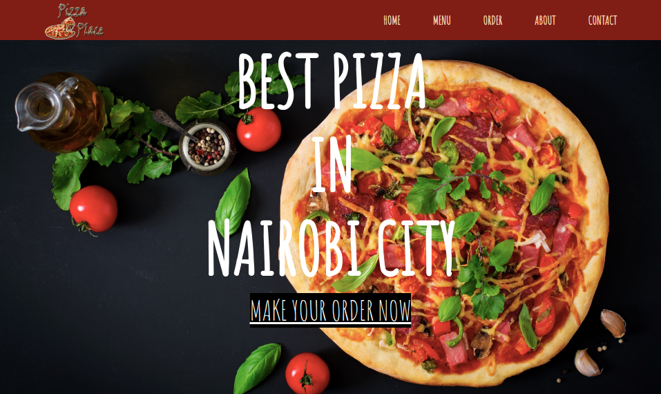

### Project Name: PIZZA PLACE

### Project Description
An individual project for Pizza Place. The system is designed as a way to widen the customer base by supplimenting sales through a web application. Customers can order different sizes of pizzas, the type and the choice of topping.

### Setup Instructions
The operations of the project are fairly straighforward. 
The application makes use of bootstrap as well as a custom CSS file.
Google Chrome is highly recommend to run the program.

* This website requires that you have data access to internet data.

### BDD
* Create HTML forms as primary step.
* For business logic: Use constructors to store input data.
* Use innerHTML to output the order to user for tracking.
* Create a function that gives the total cost for just one pizza.
* Calculate the delivery fee as part of total cost.
* Add option for ni delivery.
* Calculate total cost if user inputs two pizzas with different properties.
* create a  loop to calculate as many pizza entries as user requires

### Author: [DENNIS NJENGA](https://github.com/deepeters)
### Contact Infomation:
         Email: dennis@dennis.com
         Phone: +254712345678

### Technology Used
1. HTML
2. CSS
3. Javascript

### Frameworks Used
1. Git
2. Bootstrap
3. jQuery

### LICENSE: [MIT LICENSE](https://raw.githubusercontent.com/deepeters/fourth-ip/master/LICENSE)
